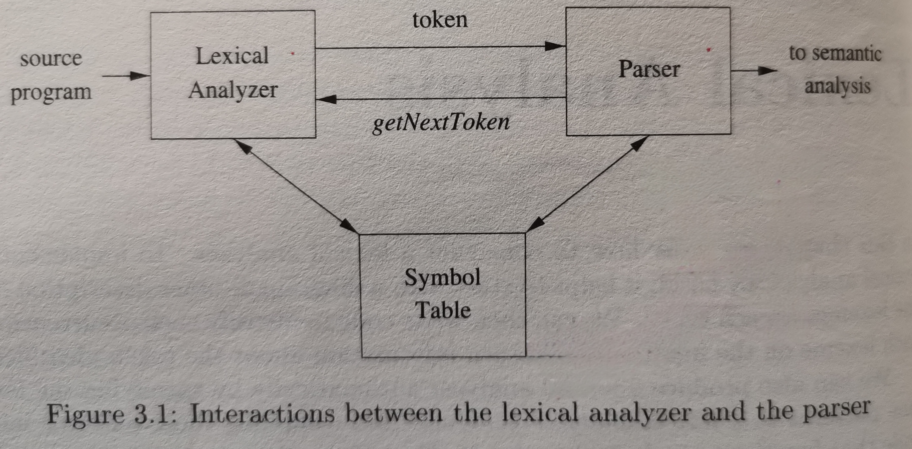
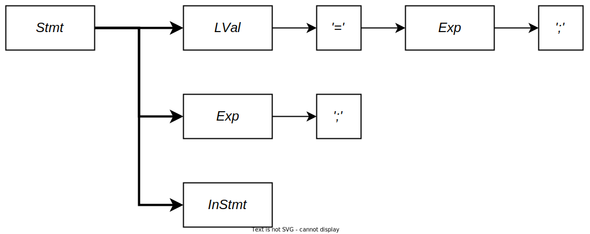

# SysY Compiler 设计文档

> **BUAA 2023 秋《编译技术》实验**
>
> ***Copyright &copy; Tony's Studio 2023***

---

# 目录

[toc]

---

# 一、前言

编译器作为平日编码中不可或缺的一部分，先前只对其概念有浅薄的理解，未曾亲手进行实现。第一次动手实现编译器，内心十分忐忑。个人对代码设计有一定的执念，但愿凭借自己的 C++ 功底与平时的设计经验，能够写出一个功能相对完善、结构良好的编译器。

---

# 二、参考编译器设计

词法分析、语法分析和语义分析主要参考了《编译原理》（龙书）中偏理论性的编译器设计，包括模块划分，以及一些处理技巧，具体代码上没有太多参考，主要根据个人理解与编程习惯进行封装与实现。中间代码生成参考了 [LLVM 的一个早期版本](https://github.com/llvm-mirror/llvm)，尽可能模仿了它的实现。目标代码生成则根据 LLVM 进行了自己的设计。

对于语法分析的方式，主要是自顶向下，以及自底向上。自顶向下优点是简单，递归下降子程序法容易实现，同时也容易进行错误处理，缺点则是无法处理左递归。而自底向上的分析是更强大的方式，大多数语言都可以用 LALR 分析，但是缺点是较（非常）复杂，错误处理也比较麻烦。因此还是选择自顶向下的递归下降子程序法实现。

对于编译的遍数，主要是一遍和多遍。多遍还是占主流的，毕竟各个功能间能够彼此独立，降低复杂度，也方便多遍进行优化。

---

# 三、总体设计

编译器采用 C++ 开发，通过 CMake 管理项目。

> 既然使用了 CLion，那么希望将来的评测机能够**支持 CMake**，从而赋予 C++ 项目管理能力，而不是在头文件中使用相对路径。🙏

2023/11/20：评测机对 C++ 太不友好，导致大项目会因为编译超时而无法评测，因此使用 Java 拙劣地重写了整个项目。重写并未改变任何设计，而且设计均基于 C++ 风格，因此下文涉及到具体实现的描述仍基于 C++ 项目。

## 3.1 第三方库

> 声明：虽然是“第三方”库，但是只是在代码结构上属于第三方库（即与编译器本身无关，是通用的库），具体库的内容也还是我自己写的。

由于近期迷恋上了 Dependency Injection（DI） 的设计模式，因此整个编译器采用 Inverse of Control 封装，各模块间通过 DI 的方式进行组合，从而将各部分解耦，并更好地管理依赖关系。为此，在编译器中引入了第三方库 [MinIoC](https://github.com/Lord-Turmoil/MinIoC) 作为 IoC Container。

C++ 原生的流很好用，但是不太习惯，而且在一些细节上不能满足编译器对读入的处理，比如行号列号、回退等，因此选择了第三方库 [Twio](https://github.com/Lord-Turmoil/Twio) 作为输入输出流的支持。

## 3.2 接口设计

整个编译器采用传统的七个主要模块：词法分析、语法分析、语义分析与中间代码生成、代码优化、目标代码生成、符号表管理与错误处理，每个模块由若干部分组成。其中，语义分析和中间代码生成实际上也被分成了两个部分，因此实际上会有八个部分。

对于接口规范，由于采用 DI，因此所有参数与依赖全部以 Interface 的形式存在，从而支持可插拔的功能，也能够灵活地配置不同特性的依赖（比如线下评测可以注入更详细的 Logger）。除了必要的依赖（如语法分析器依赖词法分析器，各阶段的分析器依赖 Logger 等），各个类之间不存在直接的调用关系，均通过中间形式（如语法树）进行解耦。

为了从源头解决 C++ 中的内存问题，代码中尽量不使用 `new` 和 `delete`，而是采用对应的智能指针封装。但是很不幸，在实现过程中还是不免喜欢裸指针，因此只有在 DI 和指针所有权有传递的地方使用了智能指针。不过对于裸指针，也是采用集中管理的形式将 `new` 和 `delete` 进行封装。经过测试，代码整体不存在内存泄漏。

## 3.3 文件组织

项目采用 CMake 管理，个人比较在意文件组织，因此按照模块划分目录结构，基本结构如下，篇幅所限，只展示主要的目录结构。

```bash
root/
├─ tomic/
│   ├─ 3rd-party/ # 第三方库
│   │   ├─ mioc/      # IoC 框架
│   │   └─ twio/      # 输入输出流支持
│   ├─ include/
│   │   └─ tomic/
│   │       ├─ ToMiCompiler.h   # 编译器 IoC 封装
│   │       ├─ lexer/       # 词法分析部分
│   │       │   └─ token/       # Token 枚举
│   │       ├─ parser/      # 语法分析、语义分析部分
│   │       │   ├─ table/       # 符号表部分
│   │       │   └─ ast/         # 语法树
│   │       │       ├─ printer/     # 语法树输出
│   │       │       └─ trans/       # 语法树变换
│   │       ├─ logger/      # 调试用日志与错误处理
│   │       │   ├─ debug/       # 调试日志
│   │       │   └─ error/       # 错误日志（用于报错）
│   │       ├─ llvm         # LLVM IR 和 MIPS 生成
│   │       │   ├─ ir           # LLVM IR 中的 Value 和 Type
│   │       │   ├─ asm          # LLVM IR 生成与输出
│   │       │   └─ mips         # MIPS 生成与输出
│   │       │       └─ memory       # 内存管理
│   │       └─ utils        # 辅助工具
│   └─ src        # 与 include 目录对应，为头文件的实现
└─ src
    └─ Main.cpp      # 编译器入口
```

编译器被拆分为模块，放置于 `tomic` 目录下，由 `ToMiCompiler.h/cpp` 进行流程封装，由 `Main.cpp` 进行命令行参数解析后启动。

---

# 四、词法分析器设计

## 4.1 总体设计

词法分析部分参考了《编译原理》中的模块划分，如下。



为了减轻 Lexical Analyzer 的工作，这里增加了 Preprocesser 来处理源代码中的注释。同时，该阶段暂时不需要使用 Symbol Table，而只需要记录 Token 流即可。

## 4.2 Preprocessor

预处理器是整个编译的第一步，它首先读取源代码文件，并过滤掉其中的注释，然后将没有注释的源代码交给 Lexical Analyzer 进行处理。

> 这里需要注意的是，为了保证 Token 的位置不变，便于之后使用获取行号列号信息，需要将注释替换为空格，而不是删掉。
>

## 4.3 Lexical Analyzer

该部分是底层的词法分析器，其读取输入流中的字符，并解析为 Token，并附带 Token 类型、lexeme（不太会翻译）、行号、列号信息。Lexical Analyzer 不主动执行，而是等待 Lexical Parser 进行调用。

Lexical Analyzer 中涉及了词法分析部分的错误处理，会将无法识别的 Token 的类型设置为 UNKNOWN，并原样递交给上层的 Lexical Parser 进行错误报告。

## 4.4 Lexical Parser

该部分是 Lexical Analyzer 的封装，不同之处在于，Lexical Analyzer 会返回非法的 Token，即 UNKNOWN，而 Lexical Parser 保证返回的 Token 是合法的。Lexical Parser 会过滤 Lexical Analyzer 返回的非法 Token，并进行错误报告。

Lexical Analyzer 作为 Lexical Parser 的依赖项，由 DI 机制自动完成依赖注入。

# 五、语法分析设计

## 5.1 总体设计

语法分析部分的主要目的是生成 AST，因此实现了一个 AST 类型，由 Syntactical Parser 通过 Lexical Parser 解析得到。

这部分重点在于自顶向下的递归子程序构造，繁而不难。为了更具灵活性，在解析过程中不做输出，而是生成语法树后，再对语法树进行输出，单独的语法树也方便之后在其上做各种操作。

## 5.2 语法树设计

这部分主要涉及语法成分的枚举，语法树结构，以及对语法树的构造与输出。

> 尽管命名采用了 AST，但如无特殊说明，本文所有语法树均指**语法推导树**，而不是抽象语法树。

对于语法成分，在指导书要求的基础上，额外增加与更改了一些非终结符，使得语法树结构更加清晰，如添加了 `IfStmt`、`ReturnStmt`、`ExpStmt`、`FuncCall` 等，对 `ForStmt` 进行了更改，变为了 `ForInitStmt` 与 `ForStepStmt`。语法成分与其名称描述采用映射类实现，该类同样采用 DI 的方式进行配置，从而方便地在本地调试和在线评测间切换。

对于语法树的结构，包括非终结符、终结符与 ε 节点（ε 节点仅用于分析，最终语法树中不包含 ε 节点）。对于语法树的实现，参考了 [TinyXML2](https://github.com/leethomason/tinyxml2)，采用链表管理子节点，并使用访问者模式实现树的遍历，实现了十分灵活的树结构。

由于文法中的左递归在解析时被全部改造为右递归，因此在生成语法树后需要进行修改。这时只需要实现一个右递归转左递归的 Visitor，对树做一次遍历即可实现。

对于树的输出，结合访问者模式与 DI，以及语法成分的映射，可以变得十分灵活。例如，可以做到本地测试时输出 XML 或 JSON 格式的语法树，并且有选择地输出语法成分，如下。

```xml
<CompUnit>
    <MainFuncDef>
        <Terminator token='INTTK' lexeme='int'/>
        <Terminator token='MAINTK' lexeme='main'/>
        <Terminator token='LPARENT' lexeme='('/>
        <Terminator token='RPARENT' lexeme=')'/>
        <Block>
            <Terminator token='LBRACE' lexeme='{'/>
            <Stmt>
                <ReturnStmt>
                    <Terminator token='RETURNTK' lexeme='return'/>
                    <Exp>
                        <Terminator token='INTCON' lexeme='0'/>
                    </Exp>
                    <Terminator token='SEMICN' lexeme=';'/>
                </ReturnStmt>
            </Stmt>
            <Terminator token='RBRACE' lexeme='}'/>
        </Block>
    </MainFuncDef>
</CompUnit>
```

## 5.3 语法分析器

语法分析器采用递归子程序的方式构建语法树，需要解决的问题是回溯和左递归文法。

对于回溯，通过分析各个语法成分的 FIRST 集合可以唯一确定接下来要分析的语法成分，类似 $LL(n)$。不过对于 `Stmt` 中的部分产生式，由于 FIRST 集合中 `Ident` 重叠过多，从而选择了进行回溯，而不是继续预读取。这里可以通过合理安排尝试次序降低回溯成本，即先尝试分析 `InStmt`，再尝试赋值语句，最后尝试表达式语句。



对于表达式部分的左递归文法，在语法分析过程中均改造为右递归文法，并以此构造语法树。解析结束后，再通过转换器将语法树转换为左递归语法树。

在代码无误的情况下，语法分析的结果是一颗符合语法的语法树，可以交给接下来的环节进一步处理。

---

# 六、错误处理与符号表设计

## 6.1 总体设计

虽然是错误处理和符号表设计，其实这一部分和语义分析的结合也十分紧密，因此语义分析部分也在这一部分完成。

语义分析以语法分析生成的语法树为输入，经过解析生成对应的符号表。而错误处理以 Logger 的形式注入到编译的每个阶段，从而可以灵活地处理错误。

## 6.2 符号表设计

符号表设计参考《编译原理》（龙书）中的链式符号表，不过在退出作用域时不进行删除，因此最终可以得到一个与语法树结构相同的树形符号表，同时采取这种方式，在整个编译过程中只需要生成一次符号表。

### 6.2.1 符号表表项

对于不同类型的符号，符号表表项分为三类：变量、常量、函数，均继承于一个基本表项。所有表项均具有基础属性“名称”。

- 对于变量表项，包括变量类型与维度信息。
- 对于常量表项，包括变量类型、维度信息与值。
- 对于函数表项，包括返回值类型，以及参数信息列表；参数信息又包括参数类型、参数名称以及维度信息。

符号表表项构造较为复杂，因此采用建造者模式进行创建。

### 6.2.2 符号表操作

在进入每一个控制块时，会为该块分配一个新的符号表，并将其父节点指向当前符号表。同时，为了将符号表与语法树结合，也会在语法树中以属性的方式记录该节点所在的符号表。

对于符号表的查询，分为局部查询与全局查询。局部查询主要为了解决声明冲突，全局查询则是对变量的引用。

> 对于符号表的查询，存在一个问题，即对于形如 `int a = 3; { int a = a; }` 的定义，在引用外层同名变量时会出现不确定的行为，即等号右侧的 `a` 应该是来自外层，还是来自左侧的声明。不同的编译器有不同行为，这里采用了指导书中取外层变量的方式。

## 6.3 语义分析设计

### 6.3.1 属性计算

基于之前的设计，语义分析器本质上是一个对语法树的 Visitor，只需要遍历一遍语法树，按顺序处理相应节点，同时生成符号表即可。

对于语法树的遍历，结合访问者模式，可以使属性计算非常容易：进入节点时计算继承属性，退出节点时计算综合属性即可。此外，由于采用基于 XML 结构的语法树，所有属性无需作为参数传递，而只用作为 XML 节点属性添加至节点即可！而之后对于属性的获取也只需查询 XML 属性，即使新添加属性，也无需对原有代码进行修改，非常方便灵活。同时，该方式也可以灵活地传递属性，以及将属性“提升”到父节点，或“下放”到子节点，以简化属性计算工作。

为了初始化常量，我们需要对表达式进行求值，例如，对于如下的常量定义：

```c
const int a = 3 * 2 + 1;
```

经过语义分析后，之前的语法树（节点）会扩充得到如下的语法树（节点）。（其中省略了大量表达式节点。）

```xml
<ConstDecl const='true' type='2'>
    <Terminator token='CONSTTK' lexeme='const' line='3' char='5'/>
    <BType type='2'>
        <Terminator token='INTTK' lexeme='int' line='3' char='11'/>
    </BType>
    <ConstDef>
        <Terminator token='IDENFR' lexeme='a' line='3' char='15'/>
        <Terminator token='ASSIGN' lexeme='=' line='3' char='17'/>
        <ConstInitVal det='true' dim='0' value='7'>
            <ConstExp const='true' det='true' type='2' value='7'>
                <AddExp det='true' type='2' value='7'>
                    <AddExp det='true' type='2' value='6'>
                        <MulExp det='true' type='2' value='6'>
                            <Terminator token='INTCON' lexeme='3' line='3' char='19'/>
                            <Terminator token='MULT' lexeme='*' line='3' char='21'/>
                            <Terminator token='INTCON' lexeme='2' line='3' char='23'/>
                        </MulExp>
                    </AddExp>
                    <Terminator token='PLUS' lexeme='+' line='3' char='25'/>
                    <MulExp det='true' type='2' value='1'>
                        <Terminator token='INTCON' lexeme='1' line='3' char='27'/>
                    </MulExp>
                </AddExp>
            </ConstExp>
        </ConstInitVal>
    </ConstDef>
    <Terminator token='SEMICN' lexeme=';' line='3' char='28'/>
</ConstDecl>
```

> 注意到，我们在编译时直接对常量表达式进行了求值，因此中间代码和目标代码中不会出现常量间的算术运算。

语义分析结束后，会将该扩充的语法树，以及生成的符号表传递给中间代码生成部分。

### 6.3.2 符号表管理

在语义分析过程中，我们需要进行符号表管理。添加符号表的动作发生在结束访问声明（或定义）类节点时。唯一的例外是函数参数，其需要被添加到函数体对应的块中，即在访问函数体时，首先向新的符号表中添加函数参数。在语义分析过程中，会在块节点（`CompUnit` 和 `Block`）中添加 `tbl` 属性，将该块与其对应的符号表 ID 对应，从而能够在之后的阶段方便的查询符号表。

## 6.4 错误处理

错误处理贯穿于整个编译的过程，需要记录每个阶段中出现的错误。为了更好地统一错误处理，我们将错误处理作为 Logger 注入每阶段的分析器中，从而能够统一记录错误，并灵活地切换错误信息的输出。不过实际上，在简化的 SysY 语言中，语义分析结束后，理论上就不应该出现错误了，因此中间代码和目标代码生成过程中并不会使用到错误处理。

---

# 七、中间代码生成设计

## 7.1 总体设计

中间代码采用 LLVM IR，参考自 LLVM 源码。这部分基本是按照 LLVM 实现的，没有太多改动，只是做了一些简化。这部分尽力做到与 Clang 生成的 LLVM 一致，并采用数字做为 Label。

## 7.2 Type

感觉 LLVM 在这里的实现非常好，不是通过比较内容来判断类型是否相同，而是同一类型在 `LLVMContext` 中只有一个实例，因此只要 `Type` 地址相同就是相同的类型，还减少了很多不必要的内存开支。同时所有类型均派生自 `Type` 是的类型嵌套十分方便。

## 7.3 Value

LLVM 中，除了顶层的 `Module` 外，其他都是 `Value`。`User` 作为特殊的 `Value`，可以引用其他 `Value`。这样的思想使得实现相当灵活。LLVM 模块的基本结构如下。其中，`GlobalVariable` 为全局变量（或常量），`GlobalString` 是输出中的格式字符串。函数由 `BasicBlock` 组成，`BasicBlock` 又由若干 `Instruction` 组成，`Instruction` 可以引用任何 `Value`。


初看 LLVM，很头疼数字编号的顺序问题，但是看到它的实现后豁然开朗。编号并不是在生成过程中确定的，而是生成结束后，通过 `SlotTracker`（很生动的名字！），遍历函数中所有 `Value`，并按顺序分配编号，这样就很自然地得到了有序的编号。

> 其实这个编号只在输出中使用，只是输出时的标记而已，并不是 `Value` 的属性，且内部并不会使用。因此每次输出时，或者对 Module 的处理结束后，通过 `SlotTracker` 对 `Value` 编号即可。

## 7.4 中间代码生成

### 7.4.1 基本生成

中间代码生成的输入是语义分析生成的语法树与符号表，要求源代码中不存在任何错误。中间代码生成器仍实现了 AST Visitor，通过对语法树的一次遍历即可得到 LLVM Module。

> 这里我们第一次理解了 C++ 中的 `private` 继承，继承了接口，但不向外部暴露。

中间代码生成中，根据 LLVM 的语义约束，有一些需要注意的地方：

1. 一个基本块不能为空，即至少有一个 `Instruction`。
2. 一个基本块只能有一个跳转或返回指令（即基本块出口）。
3. 类型需要严格匹配，如，必要时对 `!` 以及比较操作的结果使用 `zext`。

对于 1，可以向其中插入一个跳转至下一基本块的 `br` 指令解决。对于 2，可以删除基本块中第一条跳转（或返回）指令之后的所有指令。

个人认为，比较难生成的指令是 `!` 运算和比较运算，涉及到 `i1` 的使用。对于 `!`，对于 `i32` 类型的操作数，首先使用 `icmp` 指令，而对于 `i1` 类型的操作数，即连续的 `!`，与 `1` 进行 `xor` 即可。至于 `icmp` 是否进行一次取非，可以自由选择，Clang 的行为是不改变逻辑值，即 `icmp ne i32 %1, 0`，这样会多一条 `xor`。之后，根据需要，再必要时使用 `zext` 指令将 `i1` 转换为 `i32`。而对于比较运算，则需要确保比较两端的操作数类型相同，都是 `i1` 是可以的。

```c
int main()
{
    int a = 5;
    return !!a;
}
```

对于以上的代码，生成的 LLVM 如下。

```assembly
define dso_local i32 @main() {
    %1 = alloca i32
    store i32 5, i32* %1
    %2 = load i32, i32* %1
    %3 = icmp eq i32 %2, 0
    %4 = xor i1 %3, 1
    %5 = zext i1 %4 to i32
    ret i32 %5
}
```

### 7.4.2 短路求值

这里提供一个短路求值的思路，以类似综合属性、继承属性计算的方式实现短路求值。

对于条件（对应非终结符 Cond）的解析，主要涉及三个基本块：条件为真跳转的目标块，条件为假跳转的目标块，以及条件的运算所属的基本块。这三个块根据表达式的不同（如 `if`，`for`）而有一些区别，但是都符合这一模式。那么在解析前，我们应该准备好这三个基本块，但暂时不将其插入函数中。

> 需要注意的是，对于 `if`，其条件运算所属的基本块可以是当前基本块，即不用新建一个基本块专门放第一个条件。

接下来，将三个块作为节点属性，开始解析，这里主要涉及 Cond，OrExp，AndExp，和 EqExp（作为条件对应的 `Value`）。

下图为 `if (a || b && c || d)` 中 Cond 的解析过程，解析时进行先序遍历。


下面对图做一些解释。以图中 COND 节点为例，T（左上角）代表条件为真要跳转到的基本块，F（右上角）代表条件为假要跳转到的基本块，N（左下角）代表**将要生成**的条件所在的基本块，右下角（COND 没有）代表当前节点新创建的基本块。↓ 表示该基本块由父节点传递下来，↑ 表示进入时即将该基本块插入函数，并作为当前基本块，即之后生成的指令（条件计算）会添加到该基本块中。

> 这里为了顺序清晰，将 ↑ 操作放在了 EqExp 节点里，实际上在 AndExp 节点里就可以根据解析 EqExp 生成的 `Value` 生成 `br` 指令了。

那么可以看到，当 OrExp/AndExp 在有多个子节点时，通过为右节点预先创建基本块的方式，解决了左子树的跳转问题，并通过传递该节点的方式使得右节点生成的指令可以添加到该基本块。具体地，对于如下代码：

```c
int a = 1, b = 2, c = 3, d = 4;
int main()
{
    if (a || b && c || d);
    else;

    return 0;
}
```

我们生成的 LLVM IR 如下。可以看到有一些空的基本块，这些在后续的优化中可以选择性的消除掉。

```assembly
@a = dso_local global i32 1
@b = dso_local global i32 2
@c = dso_local global i32 3
@d = dso_local global i32 4

define dso_local i32 @main() {
    %1 = load i32, i32* @a
    %2 = icmp ne i32 %1, 0
    br i1 %2, label %12, label %3

3:                                                ; preds = %0
    %4 = load i32, i32* @b
    %5 = icmp ne i32 %4, 0
    br i1 %5, label %6, label %9

6:                                                ; preds = %3
    %7 = load i32, i32* @c
    %8 = icmp ne i32 %7, 0
    br i1 %8, label %12, label %9

9:                                                ; preds = %6, %3
    %10 = load i32, i32* @d
    %11 = icmp ne i32 %10, 0
    br i1 %11, label %12, label %13

12:                                               ; preds = %9, %6, %0
    br label %14

13:                                               ; preds = %9
    br label %14

14:                                               ; preds = %13, %12
    ret i32 0
}
```

### 7.4.3 函数调用

这里需要注意的是函数参数的计算顺序，即对 `f(g1(), g2(), g3())`，应该先调用 `g3()`，再调用 `g2()`，最后调用 `g1()`。在 `printf` 中，也需要注意字符串的输出应该在所有参数准备完毕之后。

---

# 八、目标代码生成设计

## 8.1 总体设计

目标代码使用 MIPS，基于 LLVM 生成。这一步主要有两部分组成，LLVM 到 MIPS 的生成器，以及内存模型（Memory Profile）。生成器负责将 LLVM IR 翻译为 MIPS 指令，而内存模型负责其中的寄存器与内存分配，包括 Stack Profile 和 Register Profile。

## 8.2 基本生成

对于 MIPS 的生成，有一些基本的注意事项。

1. `main` 函数的 return 应该调用 17 号系统调用，即带有返回值的退出。当然课程规定 `main` 函数返回 0，且 Mars 不支持带返回值的 MIPS，所以可以忽略。
2. 运算两侧应该都是寄存器，如果有立即数，也只能是右操作数为立即数，不能两个操作数都是立即数。
3. 跳转语句不支持两个 Label，因此需要将 LLVM 的 `br` 翻译为一个分支指令和一个无条件跳转指令。
4. 很奇怪，在生成中注意使用 `addu`/`subu` 替换 `add/sub`，否则会导致奇怪的错误。

## 8.3 内存管理

默认的内存模型只使用栈，即局部变量、临时变量均保存在当前函数的栈帧中。这部分的重点在于函数调用。由于参数计算顺序与函数调用顺序已经在 LLVM IR 中进行了处理，因此这里只需要处理参数的传递，和现场的保存与恢复。

在函数中，我们始终保存栈底而不是栈顶，而具体变量的偏移由内存模型管理记录。这样可以简化内存访问，省去对 `$fp` 的记录。不过实际上更完善的编译器是应该处理 `$fp` 的。函数的栈帧结构如下，注意函数（除了 `main`）可用的栈范围是 `[$sp + 4, $sp + stackTop]`（`stackTop` < 0），在 `$sp + 4` 的位置保存了 `$ra`。在计算过程中产生的临时寄存器也保存在栈中。


### 8.3.1 保存/恢复现场

在内存分配时，我们记录了当前函数栈帧的大小，因此这时只需要将 `$sp` 扩展对应大小即可。为了处理函数的嵌套调用，我们需要保存 `$ra` 寄存器，因此需要多扩展 4 字节，为目标函数预留空间。

在函数调用结束，恢复现场时，由于我们采用的寄存器分配策略（见 8.4），我们只需要恢复 `$sp` 即可，而不用恢复寄存器的值。

### 8.3.2 参数与返回值

MIPS 有 `$a0` 到 `$a3` 三个寄存器用于参数传递，有更多参数时，需要使用栈。这里需要注意，尽管可以使用 `$a0` 到 `$a3`，但仍应为它们在栈中预留 4 个位置。

## 8.4 寄存器分配

> 在设计寄存器分配策略前，我首先考虑了一个问题，“寄存器分配是为了什么？”当然，肯定得保证正确性，即通过合理的寄存器与内存交互，以消除冲突。理论课上讲到了图着色，为了尽量减少冲突，然而代价太大，而且对于复杂的代码，寄存器冲突无法避免，因此我们可以将思路转化为如何更好的换入换出寄存器。

我们采用一种线性的寄存器分配策略，类似于 Cache 中的 LRU 算法，为每个值分配一个虚拟寄存器。虚拟寄存器中主要的属性有：优先级、寄存器编号、是否活跃。虚拟寄存器活跃表示目前值在寄存器中，否则在内存中。

寄存器优先级为非负整数，0 为最高优先级，无法被换出，一般情况下为当前指令中使用到的寄存器。数值越大，优先级越低，越容易被换出。每解析一条指令，所有活跃寄存器的优先级 +1；每次被使用，或从内存中换入时，优先级置 0。

当我们获取一个 Value 对应的寄存器时，若寄存器不活跃，则尝试换入。若没有可用寄存器，则换出优先级最低的寄存器，再换入当前寄存器。

在具体生成过程中，我们可以手动调节寄存器的优先级，如立即释放一次性变量的寄存器，降低长时间不用变量的寄存器的优先级等，来提高换入换出效率，减少不必要的分配。

基于这样的寄存器分配策略，在 8.3.1 中，保存现场时，我们只需要将所有活跃寄存器换出；恢复现场时，不需要任何操作，因为当再次获取寄存器时，发现寄存器不活跃，会自动换入，类似于懒加载。

---

# 九、代码优化设计

## 9.1 编译器设计

编译器方面分为中端优化和后端优化，其中中端优化包含了生成 LLVM 本身的优化和对生成 LLVM 的优化，后者采用 Pass 的形式对 LLVM 进行多遍扫描。

编译器支持优化选项，无或 `-O0` 为不进行优化，`-O2` 为打开所有优化，`-O1` 仅作为优化测试。对于不同的选项，采用依赖注入的方式实现优化策略的切换。

## 9.2 代码优化

时间原因，没有做太多的代码优化，仅做了一些较为基础的优化。下面是优化的结果，N/A 为未进行优化。每行的优化包也含其上的所有优化，加粗为比前一行优化效果较明显的测试点。

|   优化    | testfile 1 | testfile 2 |  testfile 3  | testfile 4 |   testfile 5   |  testfile 6   |  testfile 7  |   testfile 8   |
| :-------: | :--------: | :--------: | :----------: | :--------: | :------------: | :-----------: | :----------: | :------------: |
|    N/A    |  98574.0   |   3802.0   |   310155.0   |  95510.0   |   24538097.0   |   5459616.0   |   170643.0   |   67056828.0   |
| **9.2.1** |  98336.0   | **3572.0** | **290159.0** |  93498.0   | **20002603.0** | **5146259.0** | **169057.0** |   67036824.0   |
| **9.2.2** |  98336.0   |   3572.0   |   290159.0   |  93498.0   | **19982411.0** |   5133191.0   |   169057.0   |   67036824.0   |
| **9.2.3** |  98336.0   |   3569.0   |   290102.0   |  90483.0   | **18971832.0** | **4909786.0** | **133679.0** | **19422057.0** |
| **9.2.4** |  98336.0   |   3569.0   |   290102.0   |  90483.0   | **18691832.0** |   4909786.0   | **111359.0** |   19422057.0   |

> 以下优化若无特别说明，都是基本块内部的优化。

所有优化都是对中间代码生成的 `Module` 的一个 Pass，也就是要运行多个 Pass，每个 Pass 进行小规模的优化。这里需要注意 Pass 的先后顺序，有的优化会为其他优化提供一个更好的基础。

### 9.2.1 生成器优化

生成器优化主要是在生成 LLVM 或 MIPS 时就进行指令选择。对于 LLVM 的生成，可以合并初始化时的 `getelementptr` 指令，对于 MIPS 的生成，可以省略不必要的 `j` 指令，采用位移替代乘法，并进行寄存器优化。这里主要介绍一下寄存器的优化。

其实采用 8.4 中的寄存器分配策略，已经有不错的寄存器表现了，但是还可以在其基础上做进一步优化。

首先，利用好寄存器的一些标记位，如：

- `temporary`：是否为临时寄存器，如是，则被换出时不用保存至内存，而是直接抛弃。
- `isDirty`：是否需要保存，对于有分配内存的寄存器（如局部变量），是否在换出时进行保存。

其次，在生成指令时，借助 LLVM 的 Use 关系，即时释放掉不再被使用的寄存器。具体地，有以下两种情况：

1. Value 只被使用过一次，则在这次使用后，即释放其寄存器。
2. Value 被多次使用，在最后一次使用时，释放其寄存器。

对于如何判断多次是否是最后一次使用，LLVM IR 已经给出了答案，也是数字编号的好处，即编号最大的 User。

### 9.2.2 删除空基本块

这个算是个无伤大雅的小优化，主要清理一些无意义的连续跳转，如：

```assembly
; ...
7:                                                ; preds = %4
    %8 = load i32, i32* %1
    %9 = icmp ne i32 %8, 0
    br i1 %9, label %10, label %11
10:                                               ; preds = %7
    br label %11
11:                                               ; preds = %10, %7
    br label %12
12:                                               ; preds = %11, %4
    br label %13
13:                                               ; preds = %12, %0
    ret i32 0
```

删除后效果如下。

```assembly
; ...
7:                                                ; preds = %4
    %8 = load i32, i32* %1
    %9 = icmp ne i32 %8, 0
    br label %10
10:                                               ; preds = %7, %4, %0
    ret i32 0
```

这个优化其实应该放在所有 Pass 的最后，但是因为比较简单，就先实现了。

### 9.2.3 删除冗余代码

这里的“冗余”指重复操作，主要是连续的 `load` 和 `store` 指令，以及 `-` 和 `!`。需要注意的是，对于 `load` 和 `store`，保守起见，只能删除对非数组变量的直接引用，而不能删除 `getelementptr` 得到的地址，因为数组下标是不确定的，无法确定是否存在修改。

在一个基本块中，没有必要多次连续 `load` 一个地址，因此对同一个地址，从前往后，以 `load` 为 Source，`store` 为 Sink，删除其中相同的 `load`。对于 `call`，也应算作 Sink，因为保存现场会引入更高代价的 `load` 和 `store`，不如再 `load` 一次。

与删除 `load` 相同，但是顺序相反，从后往前，以 `store` 为 Source，`load` 为 Sink，删除其中相同的 `store`。`call` 也算作 Sink。删除冗余的 `store` 看似删除的指令不多，但是为之后无用代码的删除做了准备，因为 `store` 指令的删除会使许多算数表达式失去 User，从而能够被删除。

最后，对于对同一变量的 `store` 和 `load`，可以删除 `load`，将其 Use 全部替换为前者保存的值即可。

### 9.2.4 公共表达式删除

有了先前对冗余 `load` 的处理，对于单个的变量，我们已经能够合并单个变量了，因此自然就会出现很多相同的 Binary Operator，这时，我们就可以从前向后，依次替换其后相同的运算。保守起见，函数返回值不应该被替换，不过因为我们在删除 `load` 时已经进行了处理，因此这里可以直接替换。

对于 UnaryOperator，我么可以进行合并。我的编译器里支持在算术表达式中使用 `!`，行为与 C 语言一致，因此也涉及到 `!` 的合并。这个删除比较简单，只要删除连续的 `UnaryOperator`，将后者的 Use 替换为前者的 Operand 即可。

从前向后的替换过程中，只要遇到操作数相同的运算即可替换，替换后可能出现其它公共表达式，但是都在当前之后，所以一遍就可以完成优化。

### 9.2.5 删除无用代码

这里理论上是删除对结果没有影响的代码，但时间有限，并没有实现，只是删除了没有 User 的 Instruction。（但是好像没有任何作用。😭）

---

# 后记

勉强完成了一个还算像样的编译器，最满意的部分大概是 AST 的构建吧，后续从 C++ 转 Java 确实有些着急，代码结构和风格上没能很一致，没能用 C++ 实现也很是遗憾。做得不好的地方应该是符号表的构建吧，在做语义分析时对即将生成的 LLVM 没有任何了解，导致类型转化上很是吃力。生成 LLVM 和 MIPS 的时候也是太着急了，就偷懒使用了多态，从而没能将配置的灵活性贯彻到底。此外就是优化做的有点少，确实没法再为编译实验分配更多时间了。不过整体来说，第一次构建高可配置的项目还是很满意的。😁

<p style="text-align:center"><i>When I left you, I was but a learner. Next time, I will be the master.</i></p>
